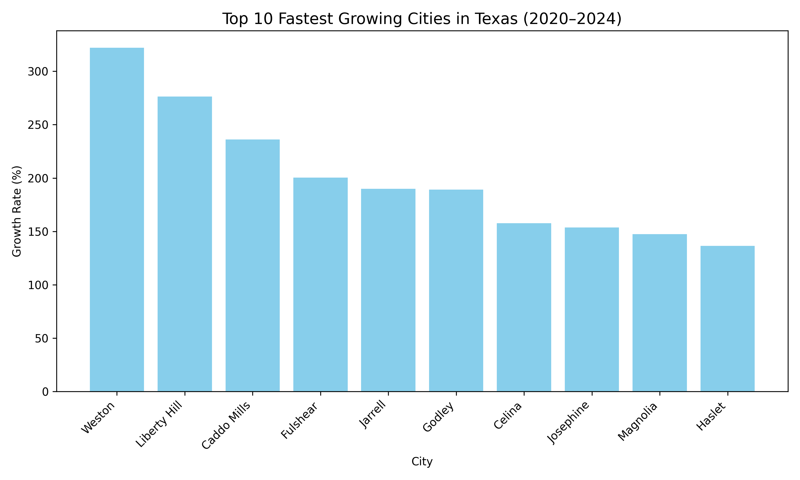
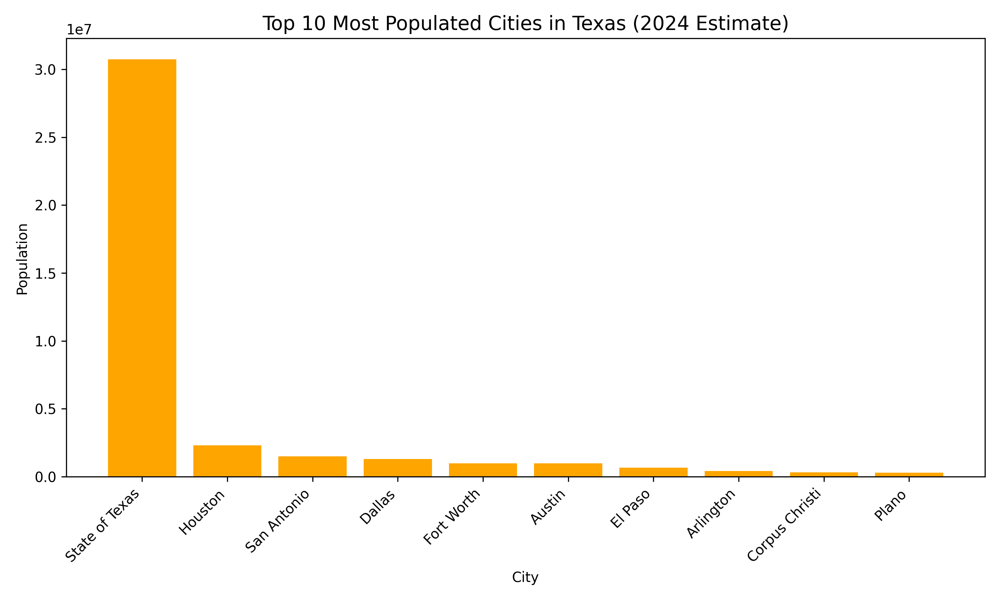

# Texas Service Areas & Population Growth

This project analyzes overlapping service areas between **CenterPoint Energy** and **Optimum Internet** in Texas, combined with U.S. Census population estimates.

## Live Demo
👉 [View Interactive Map](https://mdam182.github.io/texas-pop-growth-map/)

## Visualizations
### Top 10 Fastest Growing Cities (2020–2024)

### Top 10 Most Populated Cities (2024)

## Dataset
- `texas_both_services_data.csv` — Clean dataset with service overlap, coordinates, and population data
